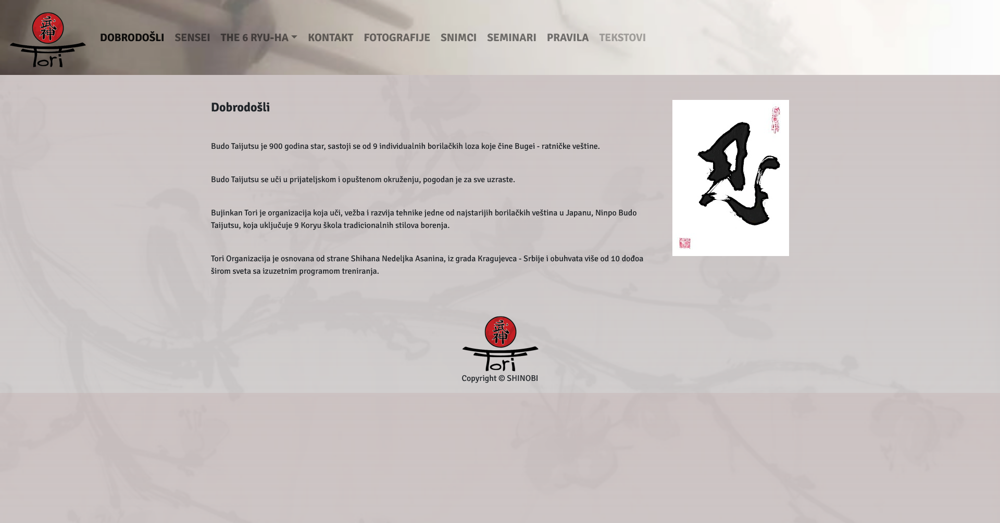

# ninjutsutori
> 
The goal of this project is to make a copy of already existing [BUJINKANTORI](http://www.bujinkantori.com/) website with some improvements in design and responsivenes.

## Built With

- HTML5
- CSS3
- Bootstrap4

## Live Demo

[Live Demo Link](https://shinobiwarior.github.io/ninjutsutori/)

## Getting Started

No prerequisites

To get  a local copy, copy up and run:

    1. Clone the repo or download the Zip folder
    2. Run live server or simply open the index.html file with a browser

To run it online just click on [Live Demo Link](https://shinobiwarior.github.io/ninjutsutori/)

## Author

👤 **Aleksandar Ivezic**

- GitHub: [Aleksandar Ivezic](https://github.com/ShinobiWarior)
- Twitter: [@Aivezic](https://twitter.com/Aivezic)
- LinkedIn: [Aleksandar Ivezic](https://www.linkedin.com/in/aleksandar-ivezi%C4%87-1a6b0391/)

## 🤝 Contributing

Contributions, issues, and feature requests are welcome!

Feel free to check the [issues page](https://github.com/ShinobiWarior/Calculator/issues).

## Show your support

Give a ⭐️ if you like this project!

